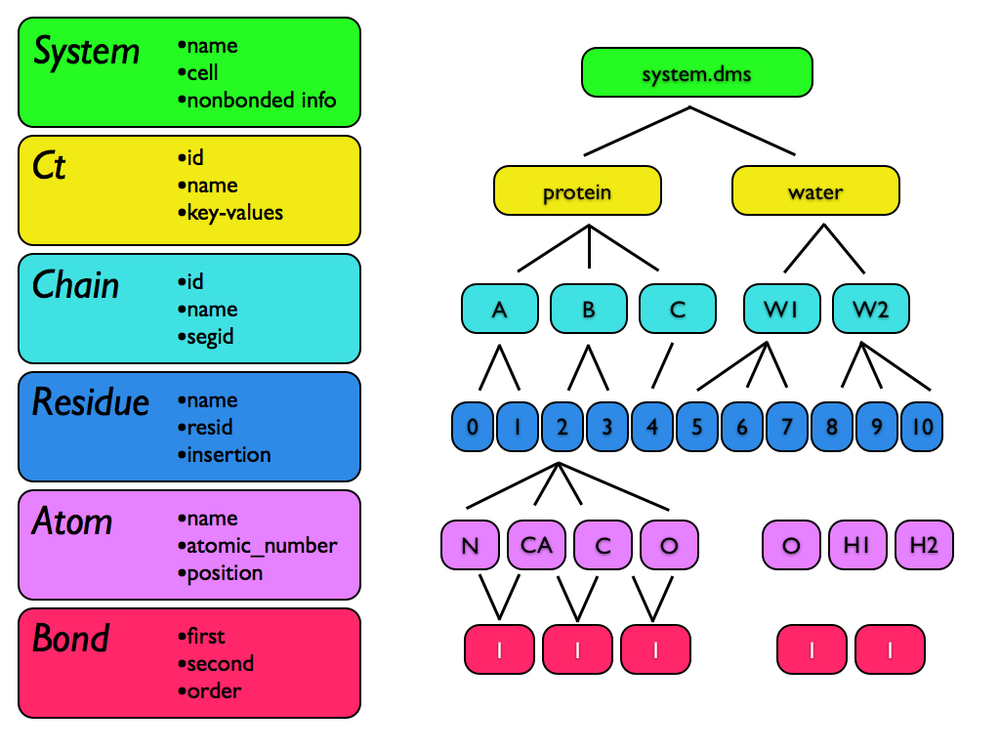

********************
Molecular Structures
********************

This section describes how msys represents molecular systems and the particles they comprise,
and the relationship between the msys representation and the various chemical file formats
msys supports.

System
======

All molecular structure in Msys is held in an object called a `System`.
Within a `System`, individual particles, including physical atoms as
well as pseudo-particles used as interaction sites, are represented as
`Atoms`.  Bonds between `Atoms` are represented by a `Bond` structure.
`Atoms` are grouped into `Residues`, and `Residues` are grouped into
`Chains`.  Finally, `Chains` are grouped into higher-level structures
called "components", or `Cts` for short.  

Every structure type is contained within its parent type; thus, even a single
particle `System` will contain (at least) one `Residue`, `Chain`, and
`Ct`.  If there is no information in the file to delineate separate
`Residues`, `Chains`, etc., then only a single such entity will be 
created.

A `System` has the following settable attributes:

* `name`: When a file is loaded, the name attribute is taken from the filename.  The name isn't
    preserved when reading and writing files, so setting it isn't all that useful.

* `positions`, `velocities`, and `cell`:  Msys stores positions and velocities for each particle,
    and three vectors, each with three components, for the periodic global cell. It's best to use
    the dedicated accessor methods to get and set these values::

        mol = msys.Load('system.dms')
        pos = mol.getPositions()  # Nx3 array
        vel = mol.getVelocities()  # Nx3 array
        box = mol.getCell()  # 3x3 array
        
        mol.setPositions(pos)
        mol.setVelocities(vel)
        mol.setCell(box)

* `nonbonded_info`: This structure holds meta-information about the type of nonbonded interactions
    used in the forcefield. It is described more fully in the section on nonbonded parameters.

There may be one or more auxiliary tables in each System, indexed by name, which hold arbitrary
additional forcefield data or other user-defined information. The main use for auxiliary tables
is to hold "cmap"-style tables from CHARMM-style forcefields.

Ct (Component)
==============

The `Ct` is the highest level of molecular organization, after the
`System`.  Many file formats, including MAE, SDF, etc., contain multiple
structures, and it can be convenient to represent the entire contents of
such a file in a single msys `System` without losing the distinction
between structure records.  When msys loads such a multi-component file,
each entry gets placed in its own `Ct`.

A Ct has the following settable attributes:

* `name`: which is settable and preserved by many file formats on read and write, including mae,
    dms, sdf, and mol2.

A Ct also stores key/value pairs, which can be either integers, floats, or strings::

    ct = mol.ct(0)
    ct["affinity"] = -4.5
    ct["name"] = "dopamine"
    ct["key"] = 625

Like a Python dictionary, you can get the set of available keys with `ct.keys()`, and get and
set values using `[]`.  Remove values for a ct using `del`, as you would for a Python dictionary.

Another use for the Ct objects is when one System is appended to another. If there were no Ct
objects, then Chains in one system might be unintentionally combined with Chains in the other
system if the Chains had the same name.

Finally, Ct blocks provide a space for arbitrary metadata about system components to be stored.

Another use for the `Ct` objects is when one `System` is appended to another.  If there were
no `Ct` objects, then `Chains` in one system might be unintentionally combined with `Chains`
in the other system if the `Chains` had the same name.  Finally, `Ct` blocks provide a space
for arbitrary metadata about system components to be stored.

.. note::

    DMS files have an unfortunate quirk in their handling of systems with multiple Cts.
    When systems are saved to DMS and then read back in, each Ct will have the union of all
    the properties in each Ct, with values defaulting to the empty string.  For example::
    
        >>> mol = msys.CreateSystem()
        >>> ct0 = mol.addCt()
        >>> ct1 = mol.addCt()
        >>> ct0['a'] = 42
        >>> ct0['b'] = 12.5
        
        >>> ct1['a'] = 42.1
        >>> ct1['c'] = "my name"
        >>> mol.save('new.dms')
        
        >>> new = msys.Load('new.dms')
    

    In the original system, we've added 'a' and 'b' properties to ct 0, and 'a' and 'c'
    properties to ct 1.  In the system which was saved to DMS and then read back in, we have::
    
        >>> for ct in new.cts:
        ...     for key in 'a', 'b', 'c':
        ...             print("ct", ct.id, key, "=", ct[key])
        ...
        ct 0 a = 42
        ct 0 b = 12.5
        ct 0 c =
        ct 1 a = 42.1
        ct 1 b =
        ct 1 c = my name

Chains, Residues, and Atoms
===========================

`Chains` in msys represent collections of `Residues`.  Their main purpose
is to hold the traditional chain and segment name information used in
popular formats such as PDB.  

`Chains` have just two settable properties: *name* and *segid*.
When loading chemical systems, `Residues` are grouped into `Chains`
entities based on their chain name and/or segid in the file, whichever
is applicable.  

A `Residue` in msys is a collection of `Atoms`.  `Residues` have three
settable attributes: *name*, *resid*, and *insertion*.  

Finally, the `Atom` class represents all particles in the `System`,
including real atoms as well as virtual and dummy particles.  Each `Atom`
has an atomic number, position, mass, and a number of other built-in
properties.

User-defined Atom properties
============================

Msys supports the creation of custom atom properties, whose name and
type (either `int`, `float`, or `string`) you specify.  These properties
are preserved by the DMS file format, but not other formats.

.. code-block::

  mol = msys.LoadDMS('input.dms')
  # find all distinct values of the 'grp_energy' atom property, if it exists
  grp_energy_vals = set()
  if 'grp_energy' in mol.atom_props:
    for atm in mol.atoms:
      grp_energy_vals.add( atm['grp_energy'] )

  # add a new property 'foo' of type 'float'
  mol.addAtomProp('foo', float)
  # Set the value of foo to the z coordinate of the atom
  for a in mol.atoms: a['foo'] = a.pos[2]

When you add a property to a set of elements, the initial value will be 0
for `int` and `float` types, and the empty string for `str` types.  If a
property with the same name and type already exists, no action is taken.
An exception is thrown if you try to add a property with the same name 
but different type from an existing property.

Msys ids
========

In msys, every Atom, Residue, Chain, and Ct has an immutable, 0-based index called an id. This
id never changes, even if you remove or add atoms, or change other properties of the system.
Two such objects of the same type will compare equal to each other if and only if they belong
the same `System` and possess the same ``id``.

When you load a system from a file, or create one from scratch, these
``ids`` will be numbered consecutively, starting at zero.  Deleting
`Atoms`, `Bonds`, etc. from the `System` can introduce gaps in the set of
``ids``, but, once created, the ``id`` of an object never changes.

For example, a Residue has both an id (unchanging msys id) and a resid, which in a PDB file
is the number associated with that Residue. You can change the resid to anything you want,
but the id of a Residue is for msys internal bookkeeping and stays the same:

... code-block::

    >>> import msys
    >>> mol=msys.Load('5ak4')
    >>> mol.natoms
    4978
    >>> mol.nresidues
    1129
    >>> mol.nchains
    2
    >>> res5=mol.residue(5)
    >>> res5.id
    5
    >>> res5.resid
    7
    >>> res5.id = 42
    Traceback (most recent call last):
      File "<stdin>", line 1, in <module>
    AttributeError: can't set attribute
    >>> res5.resid = 99
    >>>

When Msys writes a DMS file, the primary keys of the particles will
be contiguous starting at 0, and will appear in the order in which the
particles appear in the `System`, even if the ``ids`` of the atoms in the
`System` are noncontiguous due to deletions.  When Msys loads a DMS file,
if the primary keys happen to be noncontiguous, Msys will still create a
`System` with the usual contiguous ids.

Reading Files
=============

Given this hierarchical representation of chemical structure, Msys makes
a best effort attempt to map the information in a chemical file format
to its own data structures.

Files with multiple components
------------------------------

Many chemical file formats, including MAE, MOL2, SDF, as well as DMS, can contain multiple,
logically distinct chemical groups or components.  In some contexts, such as an MD simulation,
it makes sense to consider all the components as part of a single system.  In other contexts,
such as processing a large batch of ligand structures, one wants to consider the components one
at a time.  

To examine every structure in a multi-component file without having to
load them all into memory at once, use **LoadMany**.  Unlike the **Load**
function, which always returns one System, **LoadMany** is a generator
which iterates over molecular structures in the input file::

  for mol in msys.LoadMany('input.mol2'):
     print mol.name

Not every file format supports LoadMany; in cases where it doesn't, LoadMany
will stop after a single iteration, yielding just one `System`.

If you use LoadMany to load a file, each `System` will have only one
`Ct`.  However, if you use Load to import an MAE or DMS file, and the
file contains multiple components, the new `System` will contain `Ct`
elements corresponding to those components::

  mol = msys.Load('small_vancomycin_complex.mae')
  for ct in mol.cts:
     print ct.name

  # prints:
  # vancomycin_diala_complex
  # SPC water box

The ct information wil be preserved when saving the System back to an MAE
or DMS file.  

You can create a multi-ct system from existing `Systems` using the
``append`` method::

  pro = msys.Load('protein.dms')
  pro.ct(0).name = 'protein'
  wat = msys.Load('water.dms')
  wat.ct(0).name = 'water'
  pro.append(wat)
  assert pro.ncts == 2     # assuming there was 1 ct in protein.dms and wat.dms
  assert pro.ct(1).name == 'water'
  msys.Save(pro, 'combined.dms')

Mapping of residues and chains
------------------------------

Msys uses the ``chain`` and ``segid`` particle properties to group `Residues` into `Chains`.
Within a chain, `Atoms` are grouped into `Residues` based on their ``resname`` and ``resid``
attributes.  Thus, in Msys, every `Atom` within a given `Residue` has by definition the same
``resname`` and ``resid``.  By the same token, every `Atom` and `Residue` within a given `Chain`
has the same ``chain`` and ``segid``.

Upon loading a system, the number of `Chains` will be given by the number of distinct ``chain``
and ``segid`` pairs appearing in the file, and, within a given `Chain`, the number of `Residues`
will be given by the number of distinct ``resname`` and ``resid`` pairs appearing in atoms
sharing the `Chain's` ``chain`` and ``segid``.  After loading a system, one is free to modify
the ``resname`` and ``resid`` of any `Residue`.  Bear in mind, however, that if two initially
distinct `Residues` in the same `Chain` come to have identical ``resname`` and ``resid``,
they will be merged into a single `Residue` upon saving and loading.

Whitespace in atom, residue and chain names
-------------------------------------------

The PDB file format specifies that atom and residue names should be aligned to particular
columns within a 4-column region.  When Msys loads a chemical system, the following fields
are stripped of leading and trailing whitespace before they are inserted into the structure:
``name`` (atom name), ``resname`` (residue name), ``chain`` (chain identifier), and ``segid``
(segment identifier).

